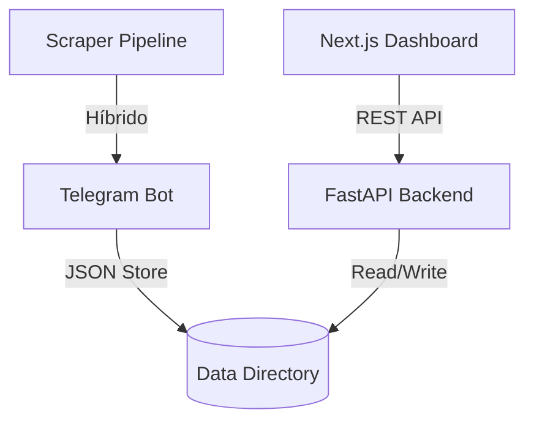

# Bot de Achadinhos — Mission Control (V5 Clean)

O projeto foi modernizado para uma arquitetura de "Mission Control", focando em estabilidade, limpeza de código e uma interface administrativa profissional.

## 🚀 O que mudou?

1. **Limpeza Profunda**:
   - Removido todo o legado de geração de PDF (`pdf_logic.py`).
   - Removidos arquivos de debug e logs temporários do repositório.
   - Constantes redundantes nos handlers foram corrigidas.
2. **Dashboard Administrativo**:
   - **Frontend**: Next.js 15 (Tailwind v4 + Lucide) em `/dashboard`.
   - **Backend API**: FastAPI em `/api` para orquestração em tempo real.
   - **Design System**: Inspirado no Telegram Desktop Dark Mode para familiaridade e baixa carga cognitiva.
3. **Sincronização**:
   - Repositório sincronizado em: `https://github.com/oclubepro-alt/bot.git`.

## 🏗️ Nova Arquitetura

## 🛠️ Próximos Passos

1. **Integração Real**: Conectar o `review_queue.py` do bot para salvar os itens no `review_queue.json` que a API consome.
2. **WebSockets**: Implementar logs em tempo real no dashboard.
3. **Deploy**: Configurar Nixpacks para rodar Bot + API no Railway/Render.
